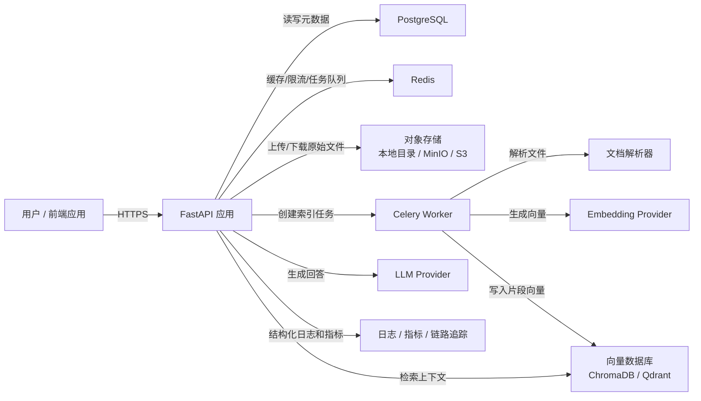
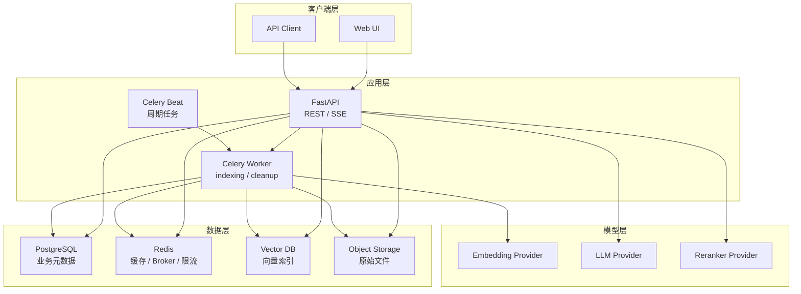
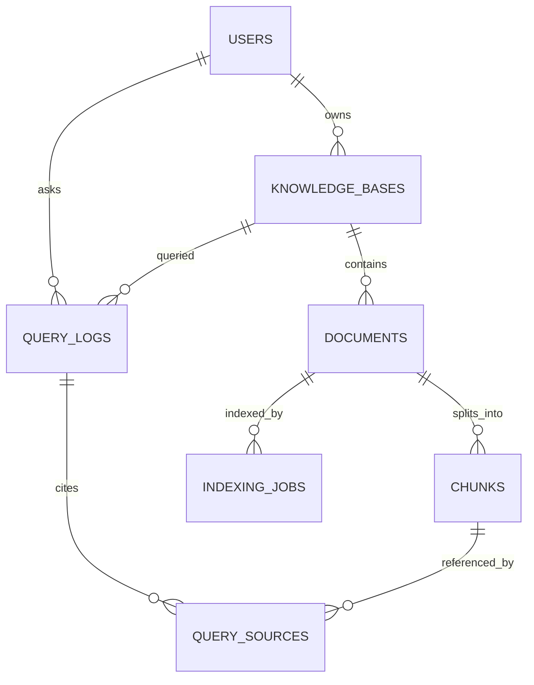
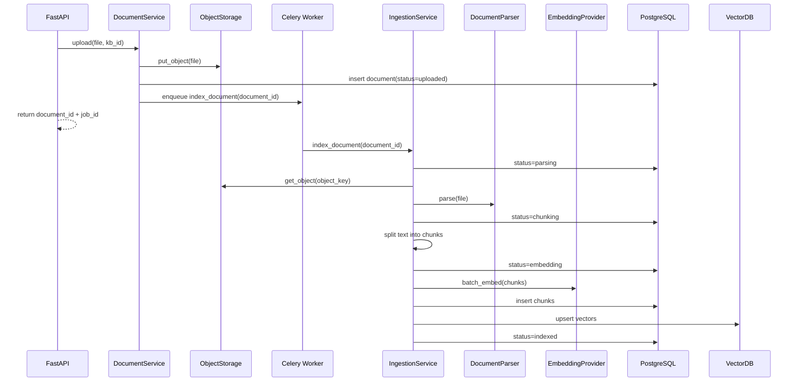
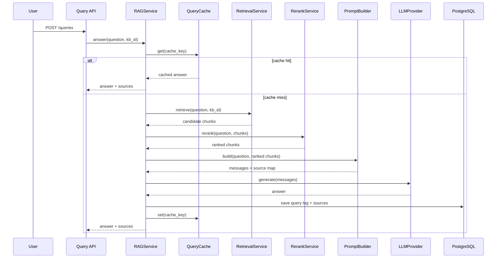

# RAG 系统项目架构设计文档

**文档版本**: v2.0  
**最后更新**: 2026-05-28  
**适用阶段**: 从 0 到 MVP，再演进到生产可用版本  
**目标读者**: 项目负责人、后端开发、算法/检索开发、前端开发、测试和运维  
**当前仓库状态**: 工作区仅包含架构文档，本文按从零启动的项目设计，不假设已有代码实现

---

## 1. 项目定位

### 1.1 项目目标

建设一个基于 RAG（Retrieval-Augmented Generation，检索增强生成）的智能问答系统，支持用户上传文档、构建知识库、基于知识库检索上下文，并调用大语言模型生成带来源引用的回答。

系统第一阶段应优先满足以下能力：

- 用户可以创建知识库并上传文档。
- 系统可以异步解析文档、切分文本、生成向量并建立索引。
- 用户可以针对指定知识库提问。
- 回答必须返回引用来源，包括文档、页码或段落位置、片段内容和相似度。
- 系统具备最小可用的状态追踪、错误处理、日志和测试基础。

### 1.2 非目标

以下能力不进入 MVP 首轮实现，避免系统过早膨胀：

- 复杂企业权限体系，例如组织层级、角色继承、细粒度字段权限。
- 多模态检索，例如图片、音频、视频内容理解。
- 自动训练或微调大语言模型。
- 完整 BI 分析平台。
- 跨区域高可用部署。
- 大规模在线评测和 A/B 测试平台。

### 1.3 质量目标

| 目标 | MVP 标准 | 生产演进标准 |
| --- | --- | --- |
| 可用性 | 单机 Docker Compose 可运行 | API、Worker、数据库、向量库可水平扩展 |
| 响应速度 | 非流式查询 P95 小于 15 秒 | 流式首 token P95 小于 3 秒 |
| 可追溯性 | 每次查询记录 request_id 和引用来源 | 查询链路可追踪到检索、重排、LLM 调用和 token 成本 |
| 准确性 | 回答必须基于检索上下文，不知道时明确说明 | 支持离线评测集，监控召回率、引用命中率和幻觉率 |
| 可维护性 | 模块边界清晰，有单元测试和集成测试 | 核心策略可配置，外部服务可替换 |

---

## 2. 总体架构

### 2.1 架构原则

1. **先模块化单体，后服务拆分**  
   MVP 使用 FastAPI + Celery 的模块化单体结构。API、领域服务、基础设施适配器在同一代码库中，通过接口边界隔离。只有当某个模块出现独立扩缩容或团队边界需求时，再拆为独立服务。

2. **领域逻辑不直接绑定外部厂商**  
   RAG 流程只依赖抽象接口，例如 `EmbeddingProvider`、`VectorStore`、`LLMProvider`、`ObjectStorage`。OpenAI、本地模型、ChromaDB、Qdrant、MinIO 都放在基础设施适配层。

3. **索引链路异步化，查询链路轻量化**  
   文档解析、分块、Embedding 和入库属于耗时任务，必须由 Worker 异步执行。查询接口只做必要的权限、检索、生成和响应，不在请求线程中处理文档索引。

4. **所有回答都可追溯**  
   系统返回的答案必须附带来源片段。引用来源是核心产品能力，不是调试信息。

5. **配置优先，策略可替换**  
   chunk 大小、top_k、重排开关、模型名称、缓存 TTL、召回融合权重等参数必须通过配置或知识库策略控制，避免散落在代码常量中。

### 2.2 技术栈基线

| 层级 | MVP 选择 | 生产演进 | 说明 |
| --- | --- | --- | --- |
| API 框架 | FastAPI | FastAPI 多实例 | Python 生态适合快速集成 RAG 组件 |
| 应用服务器 | Uvicorn | Gunicorn + Uvicorn Worker | MVP 可直接 `uvicorn`，生产建议进程管理 |
| 异步任务 | Celery | Celery 多队列 | 文档索引、重试、清理任务使用 Worker |
| 消息中间件 | Redis | Redis Sentinel 或云托管 Redis | Celery broker、缓存和限流可复用 |
| 元数据数据库 | PostgreSQL | PostgreSQL 主备/托管版 | 保存用户、知识库、文档、任务、查询日志 |
| 文件存储 | 本地目录 | MinIO / S3 | MVP 可本地存储，接口保持对象存储语义 |
| 向量数据库 | ChromaDB | Qdrant | ChromaDB 适合本地 MVP，Qdrant 更适合生产 |
| Embedding | BGE | 多 Provider 路由 | 默认 BGE，后续可扩展 |
| LLM | 小米 MiMo（配置引用） | 多 Provider 路由和降级 | Provider 名称与参数均来自配置，不在代码硬编码 |
| 日志 | structlog | structlog + OpenTelemetry | 结构化日志贯穿链路 |
| Web UI | Next.js + React + TypeScript（同步建设） | 继续演进为多角色控制台 | 与 API 并行开发，优先覆盖核心操作流 |
| 部署 | Docker Compose | Kubernetes 或云容器服务 | 从单机可运行开始 |

补充约束：

- **中间件统一 Docker 管理**：PostgreSQL、Redis、ChromaDB、Worker、Beat 均通过 `docker compose` 统一启动和编排。
- **模型配置化**：BGE 与 MiMo 的 provider、模型名、端点、密钥全部来自配置文件和环境变量。

### 2.3 系统上下文图



### 2.4 容器视图



### 2.5 MVP 架构边界

MVP 不拆微服务，建议代码上按以下边界组织：

- **API 层**: 只处理 HTTP、鉴权、请求校验、响应序列化。
- **Application 层**: 编排用例，例如上传文档、提交索引任务、执行 RAG 查询。
- **Domain 层**: 定义实体、状态机、策略和领域错误。
- **Infrastructure 层**: 适配数据库、Redis、向量库、对象存储、外部模型。
- **Worker 层**: 执行异步任务，但复用 Application 和 Domain 逻辑。

---

## 3. 代码目录设计

建议项目根目录结构如下：

```text
RAG-Py/
├── app/
│   ├── main.py                         # FastAPI 入口
│   ├── api/
│   │   ├── deps.py                      # 依赖注入、鉴权、分页参数
│   │   ├── error_handlers.py            # 全局异常映射
│   │   └── routes/
│   │       ├── health.py                # 健康检查
│   │       ├── auth.py                  # 登录/令牌，MVP 可简化
│   │       ├── knowledge_bases.py       # 知识库管理
│   │       ├── documents.py             # 文档上传、状态、删除
│   │       ├── queries.py               # RAG 查询和流式回答
│   │       └── admin.py                 # 管理接口
│   ├── application/
│   │   ├── knowledge_base_service.py    # 知识库用例
│   │   ├── document_service.py          # 文档上传/索引状态用例
│   │   ├── ingestion_service.py         # 索引流水线编排
│   │   ├── rag_service.py               # 查询流水线编排
│   │   └── evaluation_service.py        # 离线评测，生产阶段引入
│   ├── domain/
│   │   ├── entities.py                  # KnowledgeBase、Document、Chunk 等实体
│   │   ├── enums.py                     # 文档状态、任务状态、错误码
│   │   ├── policies.py                  # 分块、检索、生成策略
│   │   └── errors.py                    # 领域异常
│   ├── infrastructure/
│   │   ├── db/
│   │   │   ├── session.py               # SQLAlchemy session
│   │   │   ├── models.py                # ORM 模型
│   │   │   ├── repositories.py          # 数据访问实现
│   │   │   └── migrations/              # Alembic 迁移
│   │   ├── cache/
│   │   │   ├── redis_client.py
│   │   │   └── query_cache.py
│   │   ├── vector_store/
│   │   │   ├── base.py                  # VectorStore 接口
│   │   │   ├── chroma_store.py
│   │   │   └── qdrant_store.py
│   │   ├── object_storage/
│   │   │   ├── base.py                  # ObjectStorage 接口
│   │   │   ├── local_storage.py
│   │   │   └── minio_storage.py
│   │   ├── llm/
│   │   │   ├── base.py                  # LLMProvider 接口
│   │   │   ├── openai_provider.py
│   │   │   └── local_provider.py
│   │   ├── embedding/
│   │   │   ├── base.py                  # EmbeddingProvider 接口
│   │   │   ├── openai_embedding.py
│   │   │   └── bge_embedding.py
│   │   └── parsing/
│   │       ├── base.py                  # DocumentParser 接口
│   │       ├── pdf_parser.py
│   │       ├── docx_parser.py
│   │       ├── markdown_parser.py
│   │       └── text_parser.py
│   ├── schemas/
│   │   ├── common.py                    # 通用响应、分页
│   │   ├── knowledge_base.py
│   │   ├── document.py
│   │   └── query.py
│   ├── tasks/
│   │   ├── celery_app.py
│   │   ├── indexing.py
│   │   ├── cleanup.py
│   │   └── maintenance.py
│   ├── core/
│   │   ├── config.py                    # Pydantic Settings
│   │   ├── logging.py                   # structlog 配置
│   │   ├── security.py                  # JWT、密码、权限
│   │   └── observability.py             # metrics/tracing
│   └── utils/
│       ├── ids.py                       # request_id、业务 ID
│       ├── time.py
│       └── text.py
├── tests/
│   ├── unit/
│   ├── integration/
│   ├── e2e/
│   └── fixtures/
├── scripts/
│   ├── seed_demo_data.py
│   ├── run_worker.ps1
│   └── evaluate_retrieval.py
├── docs/
│   └── RAG系统项目架构设计文档.md
├── docker-compose.yml
├── pyproject.toml
├── alembic.ini
└── README.md
```

目录落地规则：

- `api/routes` 不直接访问 ORM、Redis、向量库或模型 Provider。
- `application` 可以调用 repository、provider、cache 等接口，但不关心具体实现。
- `domain` 不依赖 FastAPI、SQLAlchemy、Celery、Redis。
- `infrastructure` 可以依赖外部 SDK，但外部 SDK 类型不向上泄漏到 `application`。
- Worker 任务函数只做任务入口、重试和日志包装，业务流程放在 `application/ingestion_service.py`。

---

## 4. 核心领域模型

### 4.1 实体关系



### 4.2 主要实体说明

#### User

| 字段 | 类型 | 说明 |
| --- | --- | --- |
| id | UUID | 用户 ID |
| email | string | 登录邮箱，唯一 |
| password_hash | string | 密码哈希，若接入外部 SSO 可为空 |
| role | enum | `admin`、`user` |
| status | enum | `active`、`disabled` |
| created_at | datetime | 创建时间 |
| updated_at | datetime | 更新时间 |

MVP 可以用单用户模式启动，但数据库模型仍保留用户字段，便于后续权限扩展。

#### KnowledgeBase

| 字段 | 类型 | 说明 |
| --- | --- | --- |
| id | UUID | 知识库 ID |
| owner_id | UUID | 所属用户 |
| name | string | 知识库名称 |
| description | text | 描述 |
| embedding_model | string | 当前知识库使用的 Embedding 模型 |
| vector_collection | string | 对应向量库集合名 |
| chunk_size | int | 默认分块长度 |
| chunk_overlap | int | 默认分块重叠长度 |
| retrieval_top_k | int | 默认召回数量 |
| rerank_enabled | bool | 是否启用重排 |
| status | enum | `active`、`archived` |
| created_at | datetime | 创建时间 |
| updated_at | datetime | 更新时间 |

知识库创建后不建议随意更换 `embedding_model`。如果必须更换，应触发全量重建索引。

#### Document

| 字段 | 类型 | 说明 |
| --- | --- | --- |
| id | UUID | 文档 ID |
| knowledge_base_id | UUID | 所属知识库 |
| uploader_id | UUID | 上传用户 |
| filename | string | 原始文件名 |
| content_type | string | MIME 类型 |
| object_key | string | 对象存储路径 |
| file_size | int | 文件大小，单位 byte |
| checksum | string | 文件 SHA256，用于去重 |
| parser_name | string | 实际使用的解析器 |
| page_count | int | 页数，可为空 |
| status | enum | 文档索引状态 |
| error_message | text | 失败原因摘要 |
| created_at | datetime | 创建时间 |
| updated_at | datetime | 更新时间 |

文档状态：

```text
uploaded -> parsing -> chunking -> embedding -> indexed
                    \-> failed
indexed -> deleting -> deleted
```

#### Chunk

| 字段 | 类型 | 说明 |
| --- | --- | --- |
| id | UUID | 片段 ID |
| document_id | UUID | 所属文档 |
| knowledge_base_id | UUID | 冗余字段，便于过滤 |
| chunk_index | int | 文档内片段序号 |
| content | text | 片段文本 |
| content_hash | string | 文本哈希，用于幂等写入 |
| token_count | int | token 估算 |
| page_number | int | 页码，可为空 |
| start_offset | int | 原文字符起点，可为空 |
| end_offset | int | 原文字符终点，可为空 |
| metadata | jsonb | 标题、章节、表格标识等扩展信息 |
| vector_id | string | 向量库中的点 ID |
| created_at | datetime | 创建时间 |

#### IndexingJob

| 字段 | 类型 | 说明 |
| --- | --- | --- |
| id | UUID | 索引任务 ID |
| document_id | UUID | 目标文档 |
| task_id | string | Celery task ID |
| status | enum | `queued`、`running`、`succeeded`、`failed`、`cancelled` |
| attempt | int | 当前尝试次数 |
| max_attempts | int | 最大尝试次数 |
| progress | int | 0 到 100 |
| error_code | string | 结构化错误码 |
| error_message | text | 错误摘要 |
| started_at | datetime | 开始时间 |
| finished_at | datetime | 完成时间 |
| created_at | datetime | 创建时间 |

#### QueryLog

| 字段 | 类型 | 说明 |
| --- | --- | --- |
| id | UUID | 查询 ID |
| user_id | UUID | 提问用户 |
| knowledge_base_id | UUID | 查询知识库 |
| question | text | 原始问题 |
| rewritten_queries | jsonb | 改写后的查询列表 |
| answer | text | 最终回答 |
| prompt_tokens | int | 输入 token |
| completion_tokens | int | 输出 token |
| total_tokens | int | 总 token |
| latency_ms | int | 总耗时 |
| retrieval_latency_ms | int | 检索耗时 |
| generation_latency_ms | int | 生成耗时 |
| model_name | string | LLM 名称 |
| cache_hit | bool | 是否命中缓存 |
| status | enum | `succeeded`、`failed` |
| error_message | text | 失败原因 |
| created_at | datetime | 创建时间 |

### 4.3 PostgreSQL 表设计

```sql
CREATE TABLE users (
    id UUID PRIMARY KEY,
    email VARCHAR(255) UNIQUE NOT NULL,
    password_hash TEXT,
    role VARCHAR(32) NOT NULL DEFAULT 'user',
    status VARCHAR(32) NOT NULL DEFAULT 'active',
    created_at TIMESTAMPTZ NOT NULL DEFAULT now(),
    updated_at TIMESTAMPTZ NOT NULL DEFAULT now()
);

CREATE TABLE knowledge_bases (
    id UUID PRIMARY KEY,
    owner_id UUID NOT NULL REFERENCES users(id),
    name VARCHAR(255) NOT NULL,
    description TEXT,
    embedding_model VARCHAR(128) NOT NULL,
    vector_collection VARCHAR(255) NOT NULL UNIQUE,
    chunk_size INTEGER NOT NULL DEFAULT 500,
    chunk_overlap INTEGER NOT NULL DEFAULT 50,
    retrieval_top_k INTEGER NOT NULL DEFAULT 5,
    rerank_enabled BOOLEAN NOT NULL DEFAULT false,
    status VARCHAR(32) NOT NULL DEFAULT 'active',
    created_at TIMESTAMPTZ NOT NULL DEFAULT now(),
    updated_at TIMESTAMPTZ NOT NULL DEFAULT now()
);

CREATE TABLE documents (
    id UUID PRIMARY KEY,
    knowledge_base_id UUID NOT NULL REFERENCES knowledge_bases(id),
    uploader_id UUID NOT NULL REFERENCES users(id),
    filename VARCHAR(512) NOT NULL,
    content_type VARCHAR(128) NOT NULL,
    object_key TEXT NOT NULL,
    file_size BIGINT NOT NULL,
    checksum CHAR(64) NOT NULL,
    parser_name VARCHAR(128),
    page_count INTEGER,
    status VARCHAR(32) NOT NULL DEFAULT 'uploaded',
    error_message TEXT,
    created_at TIMESTAMPTZ NOT NULL DEFAULT now(),
    updated_at TIMESTAMPTZ NOT NULL DEFAULT now(),
    UNIQUE (knowledge_base_id, checksum)
);

CREATE TABLE chunks (
    id UUID PRIMARY KEY,
    document_id UUID NOT NULL REFERENCES documents(id) ON DELETE CASCADE,
    knowledge_base_id UUID NOT NULL REFERENCES knowledge_bases(id),
    chunk_index INTEGER NOT NULL,
    content TEXT NOT NULL,
    content_hash CHAR(64) NOT NULL,
    token_count INTEGER NOT NULL DEFAULT 0,
    page_number INTEGER,
    start_offset INTEGER,
    end_offset INTEGER,
    metadata JSONB NOT NULL DEFAULT '{}'::jsonb,
    vector_id VARCHAR(255) NOT NULL UNIQUE,
    created_at TIMESTAMPTZ NOT NULL DEFAULT now(),
    UNIQUE (document_id, chunk_index)
);

CREATE TABLE indexing_jobs (
    id UUID PRIMARY KEY,
    document_id UUID NOT NULL REFERENCES documents(id) ON DELETE CASCADE,
    task_id VARCHAR(255),
    status VARCHAR(32) NOT NULL DEFAULT 'queued',
    attempt INTEGER NOT NULL DEFAULT 0,
    max_attempts INTEGER NOT NULL DEFAULT 3,
    progress INTEGER NOT NULL DEFAULT 0,
    error_code VARCHAR(128),
    error_message TEXT,
    started_at TIMESTAMPTZ,
    finished_at TIMESTAMPTZ,
    created_at TIMESTAMPTZ NOT NULL DEFAULT now()
);

CREATE TABLE query_logs (
    id UUID PRIMARY KEY,
    user_id UUID NOT NULL REFERENCES users(id),
    knowledge_base_id UUID NOT NULL REFERENCES knowledge_bases(id),
    question TEXT NOT NULL,
    rewritten_queries JSONB NOT NULL DEFAULT '[]'::jsonb,
    answer TEXT,
    prompt_tokens INTEGER NOT NULL DEFAULT 0,
    completion_tokens INTEGER NOT NULL DEFAULT 0,
    total_tokens INTEGER NOT NULL DEFAULT 0,
    latency_ms INTEGER,
    retrieval_latency_ms INTEGER,
    generation_latency_ms INTEGER,
    model_name VARCHAR(128),
    cache_hit BOOLEAN NOT NULL DEFAULT false,
    status VARCHAR(32) NOT NULL DEFAULT 'succeeded',
    error_message TEXT,
    created_at TIMESTAMPTZ NOT NULL DEFAULT now()
);

CREATE TABLE query_sources (
    id UUID PRIMARY KEY,
    query_log_id UUID NOT NULL REFERENCES query_logs(id) ON DELETE CASCADE,
    chunk_id UUID REFERENCES chunks(id),
    document_id UUID REFERENCES documents(id),
    rank INTEGER NOT NULL,
    score DOUBLE PRECISION NOT NULL,
    content TEXT NOT NULL,
    metadata JSONB NOT NULL DEFAULT '{}'::jsonb
);
```

必要索引：

```sql
CREATE INDEX idx_knowledge_bases_owner ON knowledge_bases(owner_id);
CREATE INDEX idx_documents_kb_status ON documents(knowledge_base_id, status);
CREATE INDEX idx_documents_created_at ON documents(created_at DESC);
CREATE INDEX idx_chunks_document ON chunks(document_id, chunk_index);
CREATE INDEX idx_chunks_kb ON chunks(knowledge_base_id);
CREATE INDEX idx_indexing_jobs_document ON indexing_jobs(document_id);
CREATE INDEX idx_query_logs_kb_created ON query_logs(knowledge_base_id, created_at DESC);
CREATE INDEX idx_query_logs_user_created ON query_logs(user_id, created_at DESC);
```

### 4.4 向量库 Collection 设计

每个知识库一个 collection，便于隔离和删除。collection 名建议为：

```text
kb_{knowledge_base_id_without_dash}_{embedding_model_hash}
```

向量点数据：

| 字段 | 类型 | 说明 |
| --- | --- | --- |
| id | string | 与 `chunks.vector_id` 一致 |
| vector | float[] | Embedding 向量 |
| payload.knowledge_base_id | string | 知识库 ID |
| payload.document_id | string | 文档 ID |
| payload.chunk_id | string | Chunk ID |
| payload.chunk_index | int | 文档内序号 |
| payload.content | string | 片段文本，可根据向量库能力决定是否冗余 |
| payload.filename | string | 文件名 |
| payload.page_number | int | 页码 |
| payload.content_hash | string | 内容哈希 |
| payload.created_at | string | 写入时间 |

写入原则：

- PostgreSQL 中 `chunks` 是元数据主记录。
- 向量库记录可以从 PostgreSQL 重建，因此向量库不是唯一事实源。
- 删除文档时，先将文档状态设为 `deleting`，再删除向量点和 chunk，最后将文档设为 `deleted` 或物理删除。

---

## 5. 核心模块设计

### 5.1 API 层

职责：

- 接收和验证 HTTP 请求。
- 解析身份信息并注入 `current_user`。
- 调用 Application Service。
- 将业务异常映射为稳定错误响应。
- 为每个请求生成或透传 `X-Request-ID`。
- 提供 REST 和流式 SSE 查询接口。

API 层不负责：

- 不直接拼 Prompt。
- 不直接访问向量库。
- 不直接执行文档解析。
- 不直接写 Celery 任务内部逻辑。

统一响应格式：

```json
{
  "data": {},
  "error": null,
  "request_id": "req_01HX..."
}
```

错误响应格式：

```json
{
  "data": null,
  "error": {
    "code": "DOCUMENT_PARSE_FAILED",
    "message": "文档解析失败，请检查文件格式或稍后重试",
    "details": {
      "document_id": "..."
    }
  },
  "request_id": "req_01HX..."
}
```

### 5.2 KnowledgeBaseService

职责：

- 创建、更新、归档知识库。
- 校验知识库名称、策略参数和模型配置。
- 创建向量库 collection。
- 检查用户对知识库的访问权限。

主要方法：

```python
class KnowledgeBaseService:
    async def create_knowledge_base(self, owner_id: UUID, command: CreateKnowledgeBaseCommand) -> KnowledgeBase:
        ...

    async def update_policy(self, user_id: UUID, kb_id: UUID, command: UpdateKnowledgeBasePolicyCommand) -> KnowledgeBase:
        ...

    async def assert_access(self, user_id: UUID, kb_id: UUID, action: str) -> KnowledgeBase:
        ...
```

关键规则：

- `chunk_size` 建议范围为 200 到 1500。
- `chunk_overlap` 必须小于 `chunk_size / 2`。
- 知识库存在已索引文档时，修改 `embedding_model` 必须拒绝，并提示创建新知识库或触发重建。

### 5.3 DocumentService

职责：

- 接收上传文件并计算 checksum。
- 保存原始文件到对象存储。
- 创建 Document 记录。
- 提交索引任务。
- 查询文档状态、索引进度和失败原因。
- 删除文档及其索引。

上传幂等规则：

- 同一知识库内，`checksum` 相同的文件视为重复文件。
- 如果重复文件已 `indexed`，直接返回已有文档。
- 如果重复文件处于 `failed`，允许用户重新索引。
- 如果重复文件处于 `parsing`、`chunking`、`embedding`，返回当前任务状态。

### 5.4 IngestionService

索引流水线是系统最容易出错的链路，必须显式分阶段实现。



分阶段职责：

| 阶段 | 输入 | 输出 | 失败处理 |
| --- | --- | --- | --- |
| parse | 原始文件 | `ParsedDocument` | 标记 `DOCUMENT_PARSE_FAILED`，保留原文件 |
| chunk | 解析后文本 | `ChunkDraft[]` | 标记 `DOCUMENT_CHUNK_FAILED` |
| embed | chunk 文本 | embedding 向量 | API 限流或超时可重试 |
| persist | chunk + vector | PostgreSQL + VectorDB 记录 | 使用幂等 upsert，失败可重跑 |
| finalize | 写入结果 | 文档状态 `indexed` | 更新 job 进度和统计 |

幂等要求：

- Worker 重试时不得产生重复 chunks。
- `content_hash` + `document_id` 可用于识别重复片段。
- 向量库 upsert 使用稳定 `vector_id`，例如 `chunk_{chunk_id}`。
- 一个任务失败后再次执行，应先清理该文档的旧 chunk 和向量点，再重新写入。

### 5.5 TextSplitter

MVP 默认使用层级分块：

1. 按文档结构拆分：标题、页、段落、列表、表格。
2. 段落超长时按句子拆分。
3. 句子仍超长时按字符或 token 窗口拆分。
4. 相邻 chunk 保持 `chunk_overlap` 重叠。
5. 保留来源 metadata，例如页码、标题路径、段落序号。

默认参数：

| 参数 | 默认值 | 说明 |
| --- | --- | --- |
| chunk_size | 500 | 以 token 估算为主，字符数作为兜底 |
| chunk_overlap | 50 | 保留上下文连续性 |
| min_chunk_size | 80 | 过短片段优先与相邻片段合并 |
| max_chunk_size | 900 | 超过则强制拆分 |

输出结构：

```python
class ChunkDraft(BaseModel):
    content: str
    chunk_index: int
    token_count: int
    page_number: int | None = None
    start_offset: int | None = None
    end_offset: int | None = None
    metadata: dict[str, Any] = {}
```

### 5.6 EmbeddingService

职责：

- 对文本批量生成向量。
- 根据模型限制切分 batch。
- 对相同文本做缓存。
- 记录模型名称、维度、耗时和失败原因。

接口：

```python
class EmbeddingProvider(Protocol):
    model_name: str
    dimensions: int

    async def embed_texts(self, texts: list[str]) -> list[list[float]]:
        ...

    async def embed_query(self, query: str) -> list[float]:
        ...
```

缓存 key：

```text
embedding:{provider}:{model}:{sha256(text)}
```

缓存策略：

- 文档索引的 embedding 可长期缓存 7 到 30 天。
- 查询 embedding 缓存 5 到 30 分钟。
- 如果 provider 返回限流错误，按指数退避重试，最多 3 次。

### 5.7 RetrievalService

职责：

- 将问题转换为 query embedding。
- 按知识库过滤向量检索结果。
- 可选执行关键词检索和融合。
- 返回标准化 `RetrievedChunk`。

MVP 检索策略：

1. 使用向量检索召回 `top_k * 3` 个片段。
2. 按 `score_threshold` 过滤低分结果。
3. 根据文档和相邻片段做轻量去重。
4. 返回前 `top_k` 个片段给生成模块。

生产演进策略：

- 增加 BM25 关键词召回。
- 使用 Reciprocal Rank Fusion 融合向量和关键词结果。
- 加入 Cross-Encoder 或 LLM reranker。
- 支持相邻 chunk 扩展，让答案上下文更完整。

返回结构：

```python
class RetrievedChunk(BaseModel):
    chunk_id: UUID
    document_id: UUID
    filename: str
    content: str
    score: float
    rank: int
    page_number: int | None = None
    metadata: dict[str, Any] = {}
```

### 5.8 QueryRewriteService

MVP 可以关闭查询改写，避免成本和不可控性。生产阶段再引入。

启用后建议策略：

- 对短问题生成 2 到 3 个语义等价查询。
- 保留原始问题作为第一查询。
- 改写结果必须去重。
- 改写超时不影响主查询，直接回退到原始问题。

### 5.9 RerankService

重排服务用于改善检索结果排序。

MVP：

- 默认关闭。
- 使用向量分数排序。

生产：

- 支持本地 reranker 或云端 reranker。
- 输入为原问题和候选 chunk。
- 输出为新的 rank 和 rerank_score。
- 如果 reranker 失败，降级为向量排序并记录日志。

### 5.10 PromptBuilder

Prompt 构造必须明确约束模型只基于上下文回答。

基础模板：

```text
你是一个严谨的知识库问答助手。
请只根据给定的上下文回答问题。
如果上下文不足以回答，请明确说明“根据当前知识库资料无法确定”。
回答时尽量简洁，并在关键结论后标注来源编号，例如 [1]、[2]。

问题：
{question}

上下文：
{context_blocks}

回答：
```

上下文块格式：

```text
[1] 文件：{filename}，页码：{page_number}
{chunk_content}
```

Prompt 规则：

- 不把用户上传文件名、元数据直接作为系统指令。
- 对 chunk 内容做长度限制，避免超出上下文窗口。
- 保留 source 编号和 chunk_id 的映射，便于返回引用。
- 对用户问题做基本注入检测和日志记录，但不要直接拒绝正常业务问题。

### 5.11 GenerationService

职责：

- 调用 LLM 生成答案。
- 支持普通 JSON 响应和 SSE 流式响应。
- 收集 token 用量。
- 处理超时、限流、模型错误和降级。

接口：

```python
class LLMProvider(Protocol):
    async def generate(self, messages: list[dict], options: GenerationOptions) -> GenerationResult:
        ...

    async def stream_generate(self, messages: list[dict], options: GenerationOptions) -> AsyncIterator[GenerationDelta]:
        ...
```

生成参数：

| 参数 | 默认值 | 说明 |
| --- | --- | --- |
| temperature | 0.2 | 知识问答应降低随机性 |
| max_tokens | 1024 | MVP 默认回答上限 |
| timeout_seconds | 60 | 普通查询超时 |
| stream_timeout_seconds | 120 | 流式查询超时 |

降级策略：

- LLM 限流：返回可重试错误，提示稍后重试。
- LLM 超时：如果启用流式，保留已输出内容并标记未完成；非流式返回错误。
- Provider 不可用：可切换备用 Provider，但必须记录实际模型。

### 5.12 RAGService

RAGService 是查询主编排器。



缓存 key 必须包含：

- 知识库 ID。
- 用户问题规范化文本。
- top_k。
- LLM 模型。
- Embedding 模型。
- 已索引文档版本号或知识库索引版本号。

示例：

```text
rag_answer:{kb_id}:{index_version}:{llm_model}:{top_k}:{sha256(normalized_question)}
```

只缓存成功回答。知识库新增、删除、重建索引时递增 `index_version`，自然使旧缓存失效。

---

## 6. API 设计

### 6.1 通用约定

- 所有接口路径以 `/api/v1` 开头。
- 所有写操作需要鉴权。
- MVP 可以通过环境变量启用单用户开发令牌。
- 响应中始终包含 `request_id`。
- 分页参数统一为 `page` 和 `page_size`。
- 时间使用 ISO 8601 UTC 字符串。

### 6.2 健康检查

#### `GET /api/v1/health`

用于进程存活检查，不依赖外部服务。

响应：

```json
{
  "data": {
    "status": "ok",
    "version": "0.1.0"
  },
  "error": null,
  "request_id": "req_..."
}
```

#### `GET /api/v1/health/ready`

用于就绪检查，检查 PostgreSQL、Redis、向量库和对象存储。

### 6.3 知识库接口

#### `POST /api/v1/knowledge-bases`

请求：

```json
{
  "name": "产品手册知识库",
  "description": "用于客服问答",
  "embedding_model": "text-embedding-3-small",
  "chunk_size": 500,
  "chunk_overlap": 50,
  "retrieval_top_k": 5,
  "rerank_enabled": false
}
```

响应：

```json
{
  "data": {
    "id": "8f6f...",
    "name": "产品手册知识库",
    "status": "active",
    "vector_collection": "kb_8f6f_text_embedding_3_small",
    "created_at": "2026-05-28T00:00:00Z"
  },
  "error": null,
  "request_id": "req_..."
}
```

#### `GET /api/v1/knowledge-bases`

返回当前用户可访问的知识库列表。

#### `GET /api/v1/knowledge-bases/{knowledge_base_id}`

返回知识库详情、策略参数、文档统计和索引状态统计。

#### `PATCH /api/v1/knowledge-bases/{knowledge_base_id}`

允许修改名称、描述、检索参数和重排开关。不允许在已有索引时直接修改 Embedding 模型。

### 6.4 文档接口

#### `POST /api/v1/knowledge-bases/{knowledge_base_id}/documents`

`multipart/form-data` 上传。

字段：

| 字段 | 类型 | 必填 | 说明 |
| --- | --- | --- | --- |
| file | file | 是 | PDF、DOCX、Markdown、TXT |
| metadata | JSON string | 否 | 业务标签，例如部门、版本 |
| auto_index | bool | 否 | 默认 true |

响应：

```json
{
  "data": {
    "document_id": "doc_...",
    "job_id": "job_...",
    "status": "uploaded",
    "duplicate": false
  },
  "error": null,
  "request_id": "req_..."
}
```

#### `GET /api/v1/knowledge-bases/{knowledge_base_id}/documents`

支持参数：

| 参数 | 说明 |
| --- | --- |
| status | 按文档状态过滤 |
| keyword | 按文件名搜索 |
| page | 页码 |
| page_size | 每页数量 |

#### `GET /api/v1/documents/{document_id}`

返回文档详情、索引状态、错误信息和 chunk 统计。

#### `POST /api/v1/documents/{document_id}/reindex`

重新索引文档。只允许状态为 `failed` 或 `indexed` 的文档执行。

#### `DELETE /api/v1/documents/{document_id}`

删除文档、chunk、向量点和原始文件。MVP 可以先软删除文档并异步清理向量。

### 6.5 查询接口

#### `POST /api/v1/queries`

请求：

```json
{
  "knowledge_base_id": "kb_...",
  "question": "如何重置管理员密码？",
  "top_k": 5,
  "temperature": 0.2,
  "stream": false,
  "filters": {
    "document_ids": [],
    "metadata": {
      "version": "v1"
    }
  }
}
```

响应：

```json
{
  "data": {
    "query_id": "qry_...",
    "answer": "可以在管理后台的安全设置中重置管理员密码。根据资料，如果忘记当前密码，需要由超级管理员发起重置流程。[1]",
    "sources": [
      {
        "source_id": "src_1",
        "document_id": "doc_...",
        "chunk_id": "chk_...",
        "filename": "管理员手册.pdf",
        "page_number": 12,
        "score": 0.86,
        "content": "管理员密码重置流程包括..."
      }
    ],
    "usage": {
      "prompt_tokens": 1200,
      "completion_tokens": 180,
      "total_tokens": 1380
    },
    "latency_ms": 4200,
    "cache_hit": false
  },
  "error": null,
  "request_id": "req_..."
}
```

#### `POST /api/v1/queries/stream`

使用 Server-Sent Events。

事件类型：

```text
event: metadata
data: {"query_id":"qry_...","sources":[...]}

event: delta
data: {"text":"可以"}

event: delta
data: {"text":"在管理后台"}

event: done
data: {"usage":{"total_tokens":1380},"latency_ms":4200}

event: error
data: {"code":"LLM_TIMEOUT","message":"模型响应超时"}
```

流式响应建议先完成检索并发送 `metadata`，再开始输出模型 token。

### 6.6 管理接口

MVP 可仅实现管理员可用的只读接口：

- `GET /api/v1/admin/stats`: 系统统计。
- `GET /api/v1/admin/indexing-jobs`: 索引任务列表。
- `GET /api/v1/admin/query-logs`: 查询日志列表。

生产阶段再增加任务重试、批量重建索引、模型配置管理。

---

## 7. 任务与状态设计

### 7.1 Celery 队列划分

| 队列 | 任务 | 并发建议 | 说明 |
| --- | --- | --- | --- |
| `indexing` | 文档解析、分块、Embedding、入库 | CPU 和模型限流共同决定 | 核心耗时任务 |
| `cleanup` | 删除向量、清理临时文件 | 低并发 | 避免影响索引 |
| `maintenance` | 统计刷新、失败任务扫描 | 低并发 | 周期任务 |

MVP 可以只有 `default` 队列，但代码中应保留队列名常量。

### 7.2 索引任务伪代码

```python
@celery_app.task(
    name="index_document",
    bind=True,
    autoretry_for=(TransientProviderError, RedisError),
    retry_backoff=True,
    retry_kwargs={"max_retries": 3},
)
def index_document_task(self, document_id: str) -> None:
    request_id = f"task_{self.request.id}"
    with task_logging_context(request_id=request_id, document_id=document_id):
        service = build_ingestion_service()
        run_async(service.index_document(UUID(document_id), task_id=self.request.id))
```

任务进度建议：

| 进度 | 阶段 |
| --- | --- |
| 5 | 任务启动 |
| 20 | 文件读取完成 |
| 40 | 文档解析完成 |
| 55 | 分块完成 |
| 80 | Embedding 完成 |
| 95 | 向量和 chunk 写入完成 |
| 100 | 文档状态 indexed |

### 7.3 失败分类

| 错误码 | HTTP 映射 | 是否可重试 | 说明 |
| --- | --- | --- | --- |
| `UNAUTHORIZED` | 401 | 否 | 未登录或令牌无效 |
| `FORBIDDEN` | 403 | 否 | 无知识库权限 |
| `KNOWLEDGE_BASE_NOT_FOUND` | 404 | 否 | 知识库不存在 |
| `DOCUMENT_NOT_FOUND` | 404 | 否 | 文档不存在 |
| `UNSUPPORTED_FILE_TYPE` | 400 | 否 | 不支持的文档格式 |
| `DOCUMENT_PARSE_FAILED` | 422 | 否 | 文件损坏或解析失败 |
| `EMBEDDING_RATE_LIMITED` | 503 | 是 | Embedding Provider 限流 |
| `VECTOR_STORE_UNAVAILABLE` | 503 | 是 | 向量库不可用 |
| `LLM_TIMEOUT` | 504 | 是 | LLM 超时 |
| `INTERNAL_ERROR` | 500 | 视情况 | 未分类错误 |

错误处理原则：

- 用户可理解的错误返回稳定 message。
- 详细堆栈只进入日志，不返回给用户。
- 任务失败必须记录 `error_code` 和 `error_message`。
- 可重试错误由任务系统重试；不可重试错误直接进入 `failed`。

---

## 8. 配置设计

### 8.1 环境变量

| 变量 | 示例 | 说明 |
| --- | --- | --- |
| `APP_ENV` | `local` | `local`、`staging`、`prod` |
| `APP_SECRET_KEY` | `change-me` | JWT 和签名密钥 |
| `DATABASE_URL` | `postgresql+asyncpg://...` | PostgreSQL 连接 |
| `REDIS_URL` | `redis://redis:6379/0` | Redis 连接 |
| `OBJECT_STORAGE_BACKEND` | `local` | `local`、`minio`、`s3` |
| `LOCAL_STORAGE_DIR` | `./storage` | 本地文件存储目录 |
| `MINIO_ENDPOINT` | `minio:9000` | MinIO 地址 |
| `MINIO_ACCESS_KEY` | `minioadmin` | MinIO Access Key |
| `MINIO_SECRET_KEY` | `minioadmin` | MinIO Secret Key |
| `VECTOR_STORE_BACKEND` | `chroma` | `chroma`、`qdrant` |
| `CHROMA_PERSIST_DIR` | `./chroma` | Chroma 持久化目录 |
| `QDRANT_URL` | `http://qdrant:6333` | Qdrant 地址 |
| `EMBEDDING_PROVIDER` | `openai` | Embedding Provider |
| `EMBEDDING_MODEL` | `text-embedding-3-small` | 默认 Embedding 模型 |
| `LLM_PROVIDER` | `openai` | LLM Provider |
| `LLM_MODEL` | `gpt-4.1-mini` | 默认生成模型，可按实际账号配置 |
| `OPENAI_API_KEY` | `sk-...` | OpenAI API Key |
| `QUERY_CACHE_TTL_SECONDS` | `300` | 查询缓存 TTL |
| `MAX_UPLOAD_MB` | `50` | 单文件上传上限 |
| `LOG_LEVEL` | `INFO` | 日志级别 |

### 8.2 配置对象

建议使用 `pydantic-settings`：

```python
class Settings(BaseSettings):
    app_env: str = "local"
    app_secret_key: str
    database_url: str
    redis_url: str

    object_storage_backend: Literal["local", "minio", "s3"] = "local"
    vector_store_backend: Literal["chroma", "qdrant"] = "chroma"

    embedding_provider: str = "openai"
    embedding_model: str = "text-embedding-3-small"
    llm_provider: str = "openai"
    llm_model: str = "gpt-4.1-mini"

    query_cache_ttl_seconds: int = 300
    max_upload_mb: int = 50
```

---

## 9. 安全设计

### 9.1 身份认证

MVP 两种模式：

- **开发模式**: 环境变量配置 `DEV_AUTH_TOKEN`，请求携带 `Authorization: Bearer <token>`。
- **正式模式**: 用户登录后签发 JWT，API 使用 `HTTPBearer` 校验。

JWT payload：

```json
{
  "sub": "user_id",
  "email": "user@example.com",
  "role": "user",
  "exp": 1770000000
}
```

### 9.2 授权

权限先按知识库所有者控制：

| 操作 | 权限规则 |
| --- | --- |
| 创建知识库 | 登录用户 |
| 查看知识库 | owner 或 admin |
| 上传文档 | owner 或 admin |
| 删除文档 | owner 或 admin |
| 查询知识库 | owner 或 admin |
| 查看全局日志 | admin |

后续如需多人共享知识库，再增加 `knowledge_base_members` 表。

### 9.3 文件安全

- 限制文件类型：PDF、DOCX、MD、TXT。
- 限制单文件大小，默认 50MB。
- 计算 checksum 并记录。
- 上传文件名只作为展示字段，不作为对象存储路径。
- 对象存储路径使用系统生成 ID。
- 文档解析在 Worker 中执行，避免阻塞 API。
- 对解析库错误和超时做隔离，防止单个异常文件拖垮 Worker。

### 9.4 Prompt Injection 防护

基础原则：

- 用户文档内容永远作为上下文，不作为系统指令。
- 系统 Prompt 明确要求只根据上下文回答。
- 对上下文块做编号，引用时使用编号。
- 如果问题要求忽略系统指令、泄露密钥或输出内部 Prompt，应拒绝或回到知识库问答范围。
- 日志中避免记录密钥、完整 Authorization header 和敏感配置。

### 9.5 限流

MVP 建议：

| 接口 | 限流 |
| --- | --- |
| 上传文档 | 每用户每分钟 10 次 |
| 普通查询 | 每用户每分钟 30 次 |
| 流式查询 | 每用户并发 3 条 |
| 管理接口 | 每管理员每分钟 60 次 |

限流 key：

```text
ratelimit:{user_id}:{route}
```

---

## 10. 性能与成本设计

### 10.1 查询性能预算

| 阶段 | MVP 目标 |
| --- | --- |
| 鉴权和参数校验 | 小于 50ms |
| 查询缓存检查 | 小于 20ms |
| Query Embedding | 小于 800ms |
| 向量检索 | 小于 500ms |
| 重排 | MVP 关闭 |
| Prompt 构造 | 小于 50ms |
| LLM 首响应 | 小于 5s |
| 非流式总耗时 | P95 小于 15s |

### 10.2 缓存策略

| 缓存 | Key | TTL | 失效条件 |
| --- | --- | --- | --- |
| 查询结果 | `rag_answer:{...}` | 5 分钟 | 知识库 `index_version` 改变 |
| Query Embedding | `embedding:query:{...}` | 30 分钟 | 模型变更 |
| 文档 Embedding | `embedding:doc:{...}` | 7 到 30 天 | 模型变更 |
| 知识库权限 | `kb_acl:{user_id}:{kb_id}` | 1 分钟 | 权限变更 |

### 10.3 成本控制

- 查询默认 `top_k=5`，最大不超过 20。
- Prompt 上下文 token 设置硬上限，例如 6000。
- 文档索引 batch embedding，降低请求次数。
- 对重复文档按 checksum 去重。
- 对相同文本片段按 hash 缓存 embedding。
- 记录每次查询 token 用量，按用户和知识库统计。

### 10.4 大文件处理

MVP 单文件最大 50MB。超过后拒绝，并提示拆分上传。

生产演进：

- 上传走预签名 URL。
- Worker 流式读取文件。
- 大文件按页或章节分批解析和入库。
- 支持断点式索引任务，但需要更复杂的任务状态。

---

## 11. 可观测性设计

### 11.1 日志

使用结构化日志，所有日志至少包含：

- `request_id`
- `user_id`
- `knowledge_base_id`
- `document_id` 或 `query_id`
- `event`
- `latency_ms`
- `status`
- `error_code`

示例：

```python
logger.info(
    "rag_query_completed",
    request_id=request_id,
    query_id=str(query_id),
    knowledge_base_id=str(kb_id),
    top_k=top_k,
    cache_hit=False,
    retrieval_latency_ms=320,
    generation_latency_ms=3800,
    total_tokens=1380,
)
```

### 11.2 指标

业务指标：

- `rag_queries_total`
- `rag_query_success_total`
- `rag_query_failed_total`
- `rag_query_latency_seconds`
- `rag_query_cache_hit_ratio`
- `rag_answer_with_sources_ratio`
- `documents_uploaded_total`
- `documents_indexed_total`
- `document_indexing_failed_total`

技术指标：

- `vector_search_latency_seconds`
- `embedding_request_latency_seconds`
- `llm_request_latency_seconds`
- `celery_task_latency_seconds`
- `celery_queue_depth`
- `postgres_connection_pool_in_use`
- `redis_command_latency_seconds`

### 11.3 链路追踪

一次查询建议拆为以下 span：

```text
HTTP POST /queries
  auth.check
  rag.cache.get
  retrieval.embed_query
  retrieval.vector_search
  retrieval.rerank
  prompt.build
  llm.generate
  query_log.persist
```

一次索引任务建议拆为：

```text
celery.index_document
  object_storage.download
  parser.parse
  splitter.split
  embedding.batch_embed
  postgres.insert_chunks
  vector_store.upsert
  document.finalize
```

---

## 12. 测试策略

### 12.1 测试分层

| 层级 | 目标 | 示例 |
| --- | --- | --- |
| 单元测试 | 验证纯逻辑 | 分块、缓存 key、状态机、PromptBuilder |
| 组件测试 | 验证模块接口 | DocumentService、RAGService 使用 fake provider |
| 集成测试 | 验证外部依赖 | PostgreSQL、Redis、ChromaDB/Qdrant |
| API 测试 | 验证 HTTP 契约 | 上传文档、查询、错误响应 |
| E2E 测试 | 验证完整链路 | 上传 TXT 后提问并返回引用 |
| 评测测试 | 验证检索质量 | 固定问答集的 Recall@K、MRR |

### 12.2 必测用例

文档索引：

- 上传 TXT 文档后状态从 `uploaded` 变为 `indexed`。
- 上传重复文件返回已有文档或当前任务状态。
- 不支持的文件类型返回 `UNSUPPORTED_FILE_TYPE`。
- 解析失败时文档进入 `failed`，任务记录错误码。
- Worker 重试不会产生重复 chunks。

检索与生成：

- 空知识库查询返回“当前知识库没有可用资料”。
- 检索无结果时不调用 LLM 或使用无上下文 Prompt 明确回答无法确定。
- 有检索结果时回答包含 sources。
- `top_k` 超过上限时返回参数错误。
- 查询缓存命中时不重复调用 LLM。

权限：

- 未登录不能上传或查询。
- 用户不能访问他人的知识库。
- admin 可以访问管理接口。

接口契约：

- 所有错误响应包含 `error.code` 和 `request_id`。
- 所有时间字段为 ISO 8601。
- 流式接口能发送 `metadata`、`delta`、`done`。

### 12.3 Fake Provider

为了让测试稳定，必须提供 fake provider：

- `FakeEmbeddingProvider`: 对文本 hash 生成固定维度向量。
- `FakeLLMProvider`: 根据上下文返回可预测答案。
- `InMemoryVectorStore`: 用于单元/组件测试。
- `LocalObjectStorage`: 用于集成测试。

这样核心测试不依赖外部 API，也不会产生模型调用成本。

### 12.4 质量验收指标

MVP 完成时建议满足：

- 单元测试覆盖核心 domain 和 application 逻辑。
- 上传、索引、查询完整 E2E 测试通过。
- 至少 20 条样例问答评测集，Recall@5 达到 80% 以上。
- 所有 API 错误都有稳定错误码。
- 本地 `docker compose up` 后可在 10 分钟内跑通示例。

---

## 13. 部署设计

### 13.1 Docker Compose 拓扑

```yaml
services:
  api:
    build: .
    command: uvicorn app.main:app --host 0.0.0.0 --port 8000
    ports:
      - "8000:8000"
    env_file:
      - .env
    depends_on:
      - postgres
      - redis
      - chroma

  worker:
    build: .
    command: celery -A app.tasks.celery_app worker --loglevel=info -Q indexing,cleanup,maintenance
    env_file:
      - .env
    depends_on:
      - postgres
      - redis
      - chroma

  beat:
    build: .
    command: celery -A app.tasks.celery_app beat --loglevel=info
    env_file:
      - .env
    depends_on:
      - redis

  postgres:
    image: postgres:15
    environment:
      POSTGRES_DB: rag
      POSTGRES_USER: rag
      POSTGRES_PASSWORD: rag
    volumes:
      - pg_data:/var/lib/postgresql/data

  redis:
    image: redis:7-alpine

  chroma:
    image: chromadb/chroma
    volumes:
      - chroma_data:/chroma/chroma

volumes:
  pg_data:
  chroma_data:
```

### 13.2 本地开发启动顺序

1. 创建 `.env`，填充数据库、Redis、模型 Provider 配置。
2. 启动依赖：`docker compose up postgres redis chroma`。
3. 执行数据库迁移：`alembic upgrade head`。
4. 启动 API：`uvicorn app.main:app --reload`。
5. 启动 Worker：`celery -A app.tasks.celery_app worker --loglevel=info`。
6. 上传示例文档。
7. 轮询文档状态到 `indexed`。
8. 调用 `/api/v1/queries` 验证回答和引用。

### 13.3 生产部署注意事项

- API 和 Worker 使用同一镜像，不同启动命令。
- API 可水平扩展，保持无状态。
- Worker 按队列独立扩缩容。
- PostgreSQL、Redis、向量库、对象存储使用持久化存储。
- 模型 API Key 使用 Secret 管理，不写入镜像。
- Nginx 或网关层负责 TLS、请求大小限制和基础访问日志。
- `/health` 用于存活检查，`/health/ready` 用于就绪检查。

---

## 14. 开发路线图

### Phase 0: 项目骨架和基础设施，建议 2 到 3 天

交付物：

- `pyproject.toml` 和基础依赖。
- FastAPI 应用入口。
- 配置系统。
- 结构化日志。
- PostgreSQL、Redis、ChromaDB 的 Docker Compose。
- Alembic 初始化。
- 统一错误响应。

验收标准：

- `GET /api/v1/health` 返回正常。
- 本地数据库迁移可执行。
- 测试框架可运行。

### Phase 1: 知识库和文档上传，建议 3 到 5 天

交付物：

- 用户或开发令牌鉴权。
- 知识库 CRUD。
- 文档上传接口。
- 本地对象存储适配器。
- 文档元数据表和状态查询。

验收标准：

- 能创建知识库。
- 能上传 TXT/MD 文件并生成 Document 记录。
- 重复文件按 checksum 识别。
- 未授权访问被拒绝。

### Phase 2: 文档索引流水线，建议 5 到 7 天

交付物：

- Celery Worker。
- TXT/MD/PDF/DOCX 解析器。
- TextSplitter。
- EmbeddingProvider 接口和 BGE 实现。
- ChromaDB VectorStore 实现。
- Chunk 表写入。
- 索引任务状态和失败记录。

验收标准：

- 上传文档后能异步索引到向量库。
- 索引失败有明确错误码。
- Worker 重试幂等。
- 至少有一个集成测试覆盖上传到索引完成。

### Phase 3: RAG 查询闭环，建议 5 到 7 天

交付物：

- RetrievalService。
- PromptBuilder。
- LLMProvider 接口和 MiMo 实现（配置驱动）。
- RAGService。
- `/api/v1/queries` 非流式接口。
- QueryLog 和 QuerySources。
- 查询缓存。

验收标准：

- 对已索引知识库提问能返回答案。
- 回答包含 sources。
- 无检索结果时明确说明无法确定。
- 缓存命中不重复调用 LLM。
- E2E 测试覆盖上传、索引、查询。

### Phase 4: 可用性增强，建议 5 到 7 天

交付物：

- SSE 流式查询。
- 管理接口。
- 速率限制。
- 更完整日志和指标。
- 文件删除和向量清理。
- Web UI（Next.js + React + TypeScript）与 API 同步迭代。

验收标准：

- 流式接口输出 `metadata`、`delta`、`done`。
- 管理员可查看索引任务和查询日志。
- 删除文档后不会再被检索到。
- Docker Compose 可一键启动完整系统。

### Phase 5: 检索质量优化，建议 1 到 2 周

交付物：

- BM25 关键词检索。
- RRF 融合。
- Reranker。
- Query rewrite。
- 离线评测脚本。
- 样例评测集。

验收标准：

- Recall@5、MRR 有基线和趋势记录。
- 引入优化后有评测对比。
- 任一优化模块失败时可降级。

---

## 15. 开发任务拆分清单

### 15.1 后端基础

- [ ] 初始化 Python 项目和依赖管理。
- [ ] 创建 FastAPI 应用入口。
- [ ] 接入 Pydantic Settings。
- [ ] 接入 structlog。
- [ ] 定义统一响应和错误模型。
- [ ] 实现 request_id 中间件。
- [ ] 创建健康检查接口。

### 15.2 数据库

- [ ] 配置 SQLAlchemy async engine。
- [ ] 建立 Alembic 迁移。
- [ ] 创建 users 表。
- [ ] 创建 knowledge_bases 表。
- [ ] 创建 documents 表。
- [ ] 创建 chunks 表。
- [ ] 创建 indexing_jobs 表。
- [ ] 创建 query_logs 和 query_sources 表。
- [ ] 为核心查询添加索引。

### 15.3 知识库和文档

- [ ] 实现知识库创建接口。
- [ ] 实现知识库列表和详情接口。
- [ ] 实现知识库策略更新。
- [ ] 实现文档上传接口。
- [ ] 实现 checksum 去重。
- [ ] 实现文档状态查询。
- [ ] 实现文档删除或软删除。

### 15.4 索引链路

- [ ] 实现 ObjectStorage 接口。
- [ ] 实现 LocalObjectStorage。
- [ ] 实现 DocumentParser 接口。
- [ ] 实现 TXT/MD 解析。
- [ ] 实现 PDF 解析。
- [ ] 实现 DOCX 解析。
- [ ] 实现 TextSplitter。
- [ ] 实现 EmbeddingProvider 接口。
- [ ] 实现 FakeEmbeddingProvider 用于测试。
- [ ] 实现真实 Embedding Provider。
- [ ] 实现 VectorStore 接口。
- [ ] 实现 ChromaVectorStore。
- [ ] 实现 IngestionService。
- [ ] 实现 Celery indexing task。
- [ ] 实现索引任务进度更新。

### 15.5 查询链路

- [ ] 实现 RetrievalService。
- [ ] 实现 PromptBuilder。
- [ ] 实现 LLMProvider 接口。
- [ ] 实现 FakeLLMProvider 用于测试。
- [ ] 实现真实 LLM Provider。
- [ ] 实现 RAGService。
- [ ] 实现非流式查询接口。
- [ ] 实现查询日志。
- [ ] 实现 sources 返回。
- [ ] 实现查询缓存。
- [ ] 实现 SSE 流式查询。

### 15.6 运维和质量

- [ ] 编写 Dockerfile。
- [ ] 编写 Docker Compose。
- [ ] 编写本地启动脚本。
- [ ] 接入基本指标。
- [ ] 接入限流。
- [ ] 编写 E2E 测试。
- [ ] 编写评测脚本。
- [ ] 编写 README 快速启动。

---

## 16. 关键实现建议

### 16.1 先跑通 TXT/MD，再扩展 PDF/DOCX

TXT/MD 最容易形成完整闭环。建议第一条 E2E 链路只要求：

```text
创建知识库 -> 上传 TXT -> Worker 索引 -> 查询 -> 返回答案和引用
```

闭环跑通后再引入 PDF/DOCX。这样能更早暴露领域模型、任务状态、向量库写入和查询编排的问题。

### 16.2 先使用 Fake Provider 写核心测试

外部模型调用慢、不稳定、产生费用。核心服务应先通过 Fake Provider 测试：

- 分块是否稳定。
- 检索是否返回预期 chunk。
- Prompt 是否包含来源编号。
- RAGService 是否保存 query log。
- 缓存是否生效。

真实 Provider 通过少量集成测试覆盖即可。

### 16.3 Provider 接口先小后大

不要一开始封装过多模型能力。MVP 的 Provider 接口只需要：

- `embed_texts`
- `embed_query`
- `generate`
- `stream_generate`

模型路由、fallback、多租户 key、成本报表可以后续扩展。

### 16.4 不要把 LangChain 作为核心架构边界

可以使用 LangChain 或 LlamaIndex 的部分工具，但不要让业务核心直接依赖框架对象。推荐做法：

- 解析器、splitter、retriever 可以参考或局部使用第三方库。
- Application 和 Domain 层使用自己的数据结构。
- 这样后续替换库时不会影响 API 和数据模型。

### 16.5 引用来源是硬约束

没有 sources 的回答不应视为成功 RAG 回答。对于以下情况：

- 知识库为空。
- 检索分数过低。
- 检索结果与问题明显无关。

系统应返回无法确定，而不是让 LLM 自由发挥。

---

## 17. 风险与应对

| 风险 | 影响 | 概率 | 应对措施 |
| --- | --- | --- | --- |
| 文档解析质量不稳定 | 索引内容缺失，影响回答质量 | 中 | 分格式解析，记录 parser_name 和错误；先支持稳定格式 |
| LLM 幻觉 | 用户获得错误答案 | 高 | 强制上下文回答、返回引用、无结果时拒答、建立评测集 |
| Embedding/LLM 成本超支 | 成本不可控 | 中 | 缓存、token 限额、top_k 上限、用量日志 |
| 向量库数据与 PostgreSQL 不一致 | 删除或重建索引异常 | 中 | PostgreSQL 作为事实源，向量库可重建，写入使用幂等 ID |
| Worker 重试产生重复数据 | 查询结果重复或污染 | 中 | 稳定 chunk_id/vector_id，重试前清理旧索引 |
| 大文件阻塞系统 | Worker 长时间占用 | 中 | 文件大小限制、异步任务、后续分批解析 |
| Prompt Injection | 输出越权或泄露内部信息 | 中 | 系统 Prompt 约束、上下文隔离、敏感日志脱敏 |
| Provider 不可用 | 查询或索引失败 | 中 | 超时、重试、降级、错误码和告警 |
| 检索效果差 | 回答不准确 | 高 | 分块调参、混合检索、rerank、离线评测 |

---

## 18. 验收标准

### 18.1 MVP 功能验收

MVP 可以认为完成，当以下场景全部通过：

1. 使用 Docker Compose 启动 PostgreSQL、Redis、API、Worker 和向量库。
2. 调用健康检查接口返回正常。
3. 创建一个知识库。
4. 上传一个 TXT 或 MD 文档。
5. 文档状态最终变为 `indexed`。
6. 对知识库提问，返回答案。
7. 答案包含至少一个 source。
8. 查询日志记录问题、答案、来源、耗时和 token 用量。
9. 重复上传同一文档不会生成重复索引。
10. 删除文档后，后续查询不再召回该文档内容。

### 18.2 工程验收

- 有清晰 README，包含本地启动和示例请求。
- 有数据库迁移。
- 有核心单元测试和至少一条 E2E 测试。
- 有统一错误响应。
- 有 request_id 串联日志。
- 配置通过环境变量管理。
- 外部模型调用可替换为 Fake Provider。

---

## 19. 参考接口数据结构

### 19.1 Pydantic Schema 示例

```python
class SourceDocument(BaseModel):
    source_id: str
    document_id: UUID
    chunk_id: UUID
    filename: str
    page_number: int | None = None
    score: float
    content: str
    metadata: dict[str, Any] = Field(default_factory=dict)


class QueryRequest(BaseModel):
    knowledge_base_id: UUID
    question: str = Field(min_length=1, max_length=4000)
    top_k: int = Field(default=5, ge=1, le=20)
    temperature: float = Field(default=0.2, ge=0.0, le=1.0)
    stream: bool = False
    filters: dict[str, Any] = Field(default_factory=dict)


class QueryUsage(BaseModel):
    prompt_tokens: int = 0
    completion_tokens: int = 0
    total_tokens: int = 0


class QueryResponse(BaseModel):
    query_id: UUID
    answer: str
    sources: list[SourceDocument]
    usage: QueryUsage
    latency_ms: int
    cache_hit: bool
```

### 19.2 领域命令对象示例

```python
class CreateKnowledgeBaseCommand(BaseModel):
    name: str = Field(min_length=1, max_length=255)
    description: str | None = None
    embedding_model: str
    chunk_size: int = Field(default=500, ge=200, le=1500)
    chunk_overlap: int = Field(default=50, ge=0, le=500)
    retrieval_top_k: int = Field(default=5, ge=1, le=20)
    rerank_enabled: bool = False


class IndexDocumentCommand(BaseModel):
    document_id: UUID
    force_rebuild: bool = False
```

---

## 20. 后续演进方向

当 MVP 稳定后，建议按收益排序推进：

1. **检索质量评测体系**  
   建立标准问题集，记录 Recall@K、MRR、引用命中率，避免凭感觉调参。

2. **混合检索和重排**  
   对业务文档中关键词、编号、术语较多的场景，BM25 + 向量召回通常优于单纯向量召回。

3. **知识库共享权限**  
   增加成员表和权限角色，支持团队知识库。

4. **索引版本管理**  
   支持文档更新、全量重建、灰度切换和历史版本回滚。

5. **答案反馈闭环**  
   收集用户点赞、点踩、纠错，沉淀评测数据。

6. **多 Provider 路由**  
   按知识库、用户、成本、可用性选择不同 Embedding 和 LLM Provider。

---

## 21. 术语表

| 术语 | 说明 |
| --- | --- |
| RAG | 检索增强生成，先检索外部知识，再让 LLM 基于上下文回答 |
| Knowledge Base | 知识库，一组文档和索引策略的集合 |
| Document | 用户上传的原始文档 |
| Chunk | 文档切分后的文本片段，是向量检索的基本单位 |
| Embedding | 文本向量，用于语义相似度检索 |
| Vector Store | 向量数据库，保存 chunk 向量和 metadata |
| Rerank | 对初次召回结果进行二次排序 |
| Source | 回答引用的来源片段 |
| Provider | 外部模型或基础设施的适配实现 |
| Index Version | 知识库索引版本，用于缓存失效和重建 |

---

## 22. 建议的第一周工作安排

第一周目标是跑通最小闭环，不追求复杂优化。

| 天数 | 工作重点 | 产出 |
| --- | --- | --- |
| Day 1 | 项目骨架、配置、日志、健康检查 | API 可启动，测试可运行 |
| Day 2 | 数据库模型和迁移 | users、knowledge_bases、documents、chunks 等表 |
| Day 3 | 知识库和文档上传 | 能创建知识库并上传 TXT/MD |
| Day 4 | Celery、解析、分块、FakeEmbedding | Worker 能处理索引任务 |
| Day 5 | Chroma 写入、基础检索、FakeLLM | 上传后可查询并返回引用 |
| Day 6 | 接入 BGE + MiMo（配置化） | 完成真实模型调用闭环 |
| Day 7 | E2E 测试、README、错误处理补强 | 可演示、可复现、可继续迭代 |

第一周结束时，应该可以用一份小文档完成：

```text
上传 -> 索引 -> 提问 -> 得到带引用的回答
```

这是后续所有优化的基础。

---

## 23. 项目规范与优先级里程碑（落地版）

### 23.1 核心规范

1. **模型与 Provider 规范**
   - Embedding 默认使用 **BGE**。
   - LLM 默认使用 **小米 MiMo**。
   - Provider 相关参数（模型名、端点、API Key、超时、重试）必须通过配置文件与环境变量注入，禁止业务代码硬编码。

2. **中间件管理规范**
   - PostgreSQL、Redis、ChromaDB、Worker、Beat、API 统一由 `docker compose` 管理。
   - 本地开发和 CI 的中间件拓扑保持一致，避免环境漂移。

3. **Web UI 规范**
   - Web UI 与后端并行开发，不再作为后置附属任务。
   - UI 至少覆盖三条主链路：知识库管理、文档上传/索引状态、问答与引用展示。

4. **文档与术语规范**
   - 术语统一以 `CONTEXT.md` 为准。
   - 新增业务名词、状态机字段、错误码时，同步更新 `CONTEXT.md` 和对应 API 文档。

### 23.2 里程碑（按优先级）

| 优先级 | 里程碑 | 目标 | 验收要点 |
| --- | --- | --- | --- |
| P0 | 基础可运行 | 项目骨架 + Docker 中间件 + 配置系统 | `docker compose up` 可启动；`/health` 正常；配置可读取 |
| P0 | 数据与上传闭环 | 知识库 + 文档上传 + 元数据落库 | 可创建知识库、上传文档、查询文档状态 |
| P0 | 索引闭环 | Worker 异步索引（BGE）+ 向量入库 | 文档状态可到 `indexed`，失败可定位 |
| P0 | 问答闭环 | 检索 + MiMo 生成 + 引用返回 | 返回答案且包含 sources |
| P1 | Web UI 首版 | 与后端同步形成可演示控制台 | UI 跑通上传 -> 索引 -> 提问 -> 引用 |
| P1 | 质量保障 | 测试、日志、错误码、README | E2E 可复现，request_id 全链路可追踪 |
| P2 | 检索优化 | 混合检索、重排、评测集 | Recall/MRR 有基线与对比结果 |

### 23.3 Web UI 框架调研建议

优先搜索并评估以下方向（用于快速搭建管理台）：

- Ant Design Pro（企业后台场景成熟）
- Refine + Ant Design（CRUD 与后台工作流效率高）
- Next.js + Ant Design Starter（Next.js 原生工程化更顺滑）

建议优先选一个主框架，避免在 MVP 阶段混用多套设计系统。

当前决策：

- 采用 **方案3：Next.js + Ant Design Starter** 作为 Web UI 默认实现方案。
